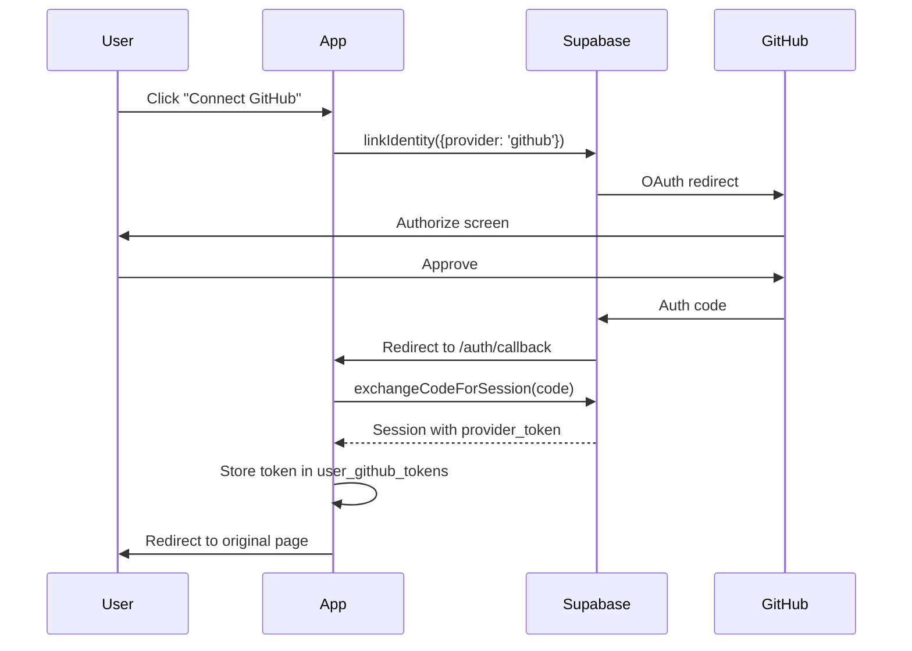
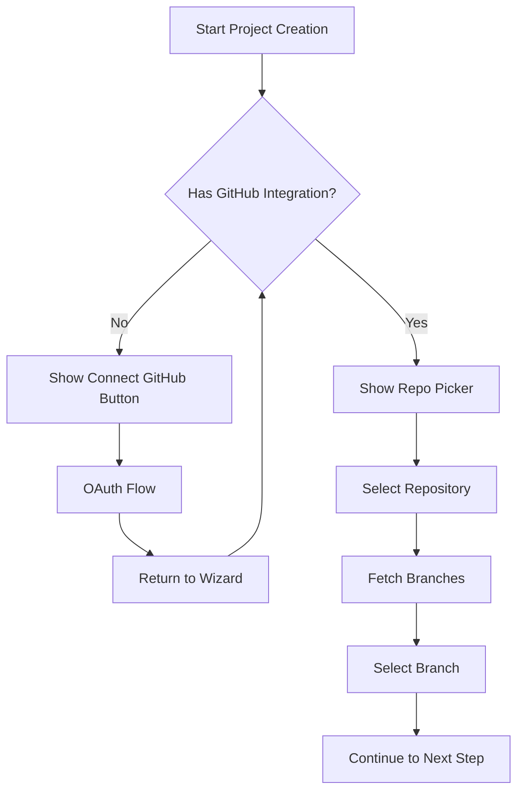

# GitHub Integration Plan

## Overview

This plan implements GitHub OAuth integration using Supabase's built-in identity linking. Users can connect their GitHub account, select repositories as project source code, view integrations in Account Settings, and edit repository/branch in project details.

**Key Architecture Decision**: Since Supabase doesn't persist OAuth provider tokens, we'll capture and store the GitHub access token at callback time in a `user_github_tokens` table for GitHub API access.

---

## Phase 0: Local Supabase and GitHub OAuth Setup

### 0.1 Create GitHub OAuth App

1. Go to **GitHub** > **Settings** > **Developer settings** > **OAuth Apps** > **New OAuth App**
2. Fill in:

   - **Application name**: `Customize Dev (Local)`
   - **Homepage URL**: `http://localhost:3000`
   - **Authorization callback URL**: `http://127.0.0.1:54321/auth/v1/callback`

(Uses local Supabase Auth port from config.toml)

3. Copy the **Client ID** and generate a **Client Secret**

### 0.2 Configure Local Supabase

Update [supabase/config.toml](customize-dev/supabase/config.toml):

**Enable manual identity linking** (around line 140):

```toml
enable_manual_linking = true
```

**Update redirect URLs** (around line 125):

```toml
additional_redirect_urls = ["http://127.0.0.1:3000/auth/callback", "http://localhost:3000/auth/callback"]
```

**Add GitHub OAuth provider** (after the `[auth.external.apple]` section):

```toml
[auth.external.github]
enabled = true
client_id = "env(SUPABASE_AUTH_EXTERNAL_GITHUB_CLIENT_ID)"
secret = "env(SUPABASE_AUTH_EXTERNAL_GITHUB_SECRET)"
redirect_uri = ""
```

### 0.3 Add Environment Variables

Add to `.env` or `.env.local`:

```bash
# GitHub OAuth credentials from GitHub OAuth App
SUPABASE_AUTH_EXTERNAL_GITHUB_CLIENT_ID=your_github_client_id
SUPABASE_AUTH_EXTERNAL_GITHUB_SECRET=your_github_client_secret
```

### 0.4 Restart Supabase

After config changes, restart local Supabase:

```bash
supabase stop && supabase start
```

---

## Phase 1: Database and Infrastructure Setup

### 1.1 Create Migration for GitHub Token Storage

Create `supabase/migrations/20251221000000_add_github_tokens.sql`:

```sql
-- Table to store GitHub OAuth tokens for API access
CREATE TABLE public.user_github_tokens (
  id uuid PRIMARY KEY DEFAULT gen_random_uuid(),
  user_id uuid NOT NULL REFERENCES auth.users(id) ON DELETE CASCADE,
  access_token text NOT NULL,
  github_username text,
  github_user_id text,
  created_at timestamptz DEFAULT now(),
  updated_at timestamptz DEFAULT now(),
  UNIQUE(user_id)
);

-- RLS policies
ALTER TABLE public.user_github_tokens ENABLE ROW LEVEL SECURITY;

CREATE POLICY "Users can view own tokens" ON public.user_github_tokens
  FOR SELECT USING (auth.uid() = user_id);

CREATE POLICY "Users can insert own tokens" ON public.user_github_tokens
  FOR INSERT WITH CHECK (auth.uid() = user_id);

CREATE POLICY "Users can update own tokens" ON public.user_github_tokens
  FOR UPDATE USING (auth.uid() = user_id);

CREATE POLICY "Users can delete own tokens" ON public.user_github_tokens
  FOR DELETE USING (auth.uid() = user_id);
```

### 1.2 Update `source_codes.kind` Type

The existing `source_codes` table already has `repository_url` and `repository_branch` columns. Update the `kind` to support `'github'` alongside `'path'`.

---

## Phase 2: GitHub OAuth Flow

### 2.1 Create Auth Callback Route

Create `src/app/auth/callback/route.ts`:

```typescript
// Handle OAuth callback, exchange code for session
// Capture provider_token and store in user_github_tokens
// Redirect to ?next= param or default destination
```

Key logic:

- Use `supabase.auth.exchangeCodeForSession(code)`
- Extract `session.provider_token` and `session.user.user_metadata`
- Upsert into `user_github_tokens` table
- Redirect to the `next` parameter (for returning to project wizard)

### 2.2 Create GitHub Integration Service

Create `src/lib/integrations/github.ts`:

```typescript
// Functions:
// - initiateGitHubLink(redirectTo: string) - starts OAuth flow
// - getGitHubToken(userId: string) - retrieves stored token
// - hasGitHubIntegration(userId: string) - checks if linked
// - disconnectGitHub(userId: string) - removes token
// - fetchUserRepos(token: string) - lists user repos
// - fetchRepoBranches(token: string, owner: string, repo: string)
```

### 2.3 Create API Routes for GitHub Data

Create `src/app/api/integrations/github/route.ts`:

- `GET` - Check if user has GitHub integration
- `DELETE` - Disconnect GitHub integration

Create `src/app/api/integrations/github/repos/route.ts`:

- `GET` - List user's GitHub repositories

Create `src/app/api/integrations/github/repos/[owner]/[repo]/branches/route.ts`:

- `GET` - List branches for a specific repository

---

## Phase 3: Account Settings Integrations UI

### 3.1 Create Integrations Section Component

Create `src/components/account/integrations-section.tsx`:

```typescript
// Display connected integrations (currently GitHub only)
// Show "Connect GitHub" button or "Connected as @username" with disconnect option
// Handle OAuth redirect back to settings page
```

### 3.2 Update Account Settings Page

Update [src/app/(authenticated)/account/settings/page.tsx](customize-dev/src/app/\\\\\\\\\\\\\\(authenticated)/account/settings/page.tsx):

- Add third section for "Integrations"
- Render `IntegrationsSection` component

---

## Phase 4: Project Creation with GitHub Source

### 4.1 Update Shared Types

Update [src/components/projects/shared/types.ts](customize-dev/src/components/projects/shared/types.ts):

```typescript
export type CodebaseMode = 'upload-folder' | 'github'

// Add new props for GitHub selection
export type GitHubRepoPickerProps = {
  selectedRepo: { owner: string; name: string; fullName: string } | null
  selectedBranch: string | null
  onRepoChange: (repo: ...) => void
  onBranchChange: (branch: string) => void
  onConnectGitHub: () => void
  hasGitHubIntegration: boolean
}
```

### 4.2 Create GitHub Repo Picker Component

Create `src/components/projects/shared/github-repo-picker/index.tsx`:

```typescript
// If no GitHub integration: show "Connect GitHub" button
// If integrated: show repo dropdown, then branch dropdown
// Use useEffect to fetch repos/branches via API
```

### 4.3 Update Source Code Card

Update [src/components/projects/shared/source-code-card/index.tsx](customize-dev/src/components/projects/shared/source-code-card/index.tsx):

- Enable GitHub option in ToggleGroup (remove `disabled: true`)
- Render `GitHubRepoPicker` when `codebaseMode === 'github'`

### 4.4 Update Project Create Form

Update [src/components/projects/project-create-form/index.tsx](customize-dev/src/components/projects/project-create-form/index.tsx):

- Add state for `selectedRepo`, `selectedBranch`, `hasGitHubIntegration`
- Check GitHub integration status on mount
- Handle "Connect GitHub" click - save form state to sessionStorage, redirect to OAuth
- On return from OAuth, restore form state from sessionStorage
- Update form submission to handle `codebaseMode === 'github'`

### 4.5 Update Project API Route

Update [src/app/api/projects/route.ts](customize-dev/src/app/api/projects/route.ts):

- Accept `repositoryUrl` and `repositoryBranch` in request body
- Create `source_codes` record with `kind: 'github'`

---

## Phase 5: Edit Repository/Branch in Project Details

### 5.1 Update Edit Project Dialog

Update [src/components/projects/project-detail/edit-project-dialog/index.tsx](customize-dev/src/components/projects/project-detail/edit-project-dialog/index.tsx):

- Add section for source code settings when `kind === 'github'`
- Show repo/branch dropdowns (reuse `GitHubRepoPicker`)
- Allow changing branch, or switching repository

### 5.2 Update Project PATCH API

Update [src/app/api/projects/[id]/route.ts](customize-dev/src/app/api/projects/[id]/route.ts):

- Accept `repositoryUrl` and `repositoryBranch` updates
- Update linked `source_codes` record

---

## Phase 6: TypeScript Types Update

### 6.1 Regenerate Supabase Types

Run `npx supabase gen types typescript` after migration to update [src/types/supabase.ts](customize-dev/src/types/supabase.ts) with the new `user_github_tokens` table.

---

## File Changes Summary

| File | Action |

|------|--------|

| `supabase/config.toml` | Update (enable GitHub OAuth, manual linking, redirect URLs) |

| `supabase/migrations/20251221000000_add_github_tokens.sql` | Create |

| `src/app/auth/callback/route.ts` | Create |

| `src/lib/integrations/github.ts` | Create |

| `src/app/api/integrations/github/route.ts` | Create |

| `src/app/api/integrations/github/repos/route.ts` | Create |

| `src/app/api/integrations/github/repos/[owner]/[repo]/branches/route.ts` | Create |

| `src/components/account/integrations-section.tsx` | Create |

| `src/components/projects/shared/github-repo-picker/index.tsx` | Create |

| `src/app/(authenticated)/account/settings/page.tsx` | Update |

| `src/components/projects/shared/types.ts` | Update |

| `src/components/projects/shared/source-code-card/index.tsx` | Update |

| `src/components/projects/project-create-form/index.tsx` | Update |

| `src/components/projects/project-detail/edit-project-dialog/index.tsx` | Update |

| `src/app/api/projects/route.ts` | Update |

| `src/app/api/projects/[id]/route.ts` | Update |

| `src/types/supabase.ts` | Regenerate |

---

## Environment Variables Summary

For local development, add to `.env` (in supabase directory) or ensure available in shell:

```bash
# GitHub OAuth credentials (from Phase 0.1)
SUPABASE_AUTH_EXTERNAL_GITHUB_CLIENT_ID=your_github_client_id
SUPABASE_AUTH_EXTERNAL_GITHUB_SECRET=your_github_client_secret
```

For production deployment (Supabase Cloud), configure via:

- Supabase Dashboard > Authentication > Providers > GitHub
- Or via `supabase secrets set` CLI command

---

## Flow Diagrams

### GitHub OAuth Link Flow



### Project Creation with GitHub

