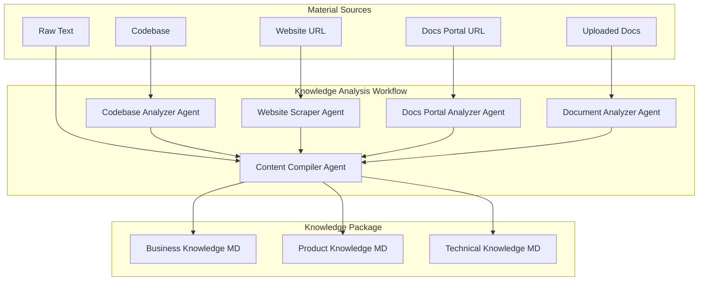

# Knowledge Package Analysis System

## Architecture Overview



## Database Schema

Create new tables in [`supabase/migrations/`](customize-dev/supabase/migrations/):

**`knowledge_sources`** - Stores raw material inputs

- `project_id` (FK to projects)
- `type`: enum ('codebase', 'website', 'docs_portal', 'uploaded_doc', 'raw_text')
- `url` (for website/docs_portal)
- `storage_path` (for uploaded docs)
- `content` (for raw text)
- `status`: enum ('pending', 'processing', 'completed', 'failed')

**`knowledge_packages`** - Stores compiled knowledge

- `project_id` (FK to projects)
- `category`: enum ('business', 'product', 'technical')
- `storage_path` (Supabase Storage path to MD file)
- `version` (incremented on re-analysis)
- `generated_at`

## Mastra Workflow

Create [`src/mastra/workflows/knowledge-analysis-workflow.ts`](customize-dev/src/mastra/workflows/):

```typescript
// Step 1: Analyze Codebase (uses source_code from project)
// Step 2: Scrape Website (if URL provided)
// Step 3: Scrape Docs Portal (if URL provided)
// Step 4: Analyze Uploaded Docs (if any)
// Step 5: Process Raw Text (if any)
// Step 6: Compile all into categorized knowledge package
```

Key workflow steps:

1. **analyzeCodebase** - Uses coding agent to scan source code, extract API routes, data models, key features
2. **scrapeWebsite** - Navigates website, extracts company info, product descriptions, pricing
3. **scrapeDocsPortal** - Crawls docs, extracts how-tos, API references, tutorials
4. **analyzeDocuments** - Processes uploaded PDFs/docs using LLM
5. **compileKnowledge** - Merges all outputs into three categorized MD files

## Agents

Create in [`src/mastra/agents/`](customize-dev/src/mastra/agents/):

1. **codebase-analyzer-agent.ts** - Specialized agent with instructions for extracting product knowledge from code
2. **web-scraper-agent.ts** - Agent with browser tools for scraping websites
3. **knowledge-compiler-agent.ts** - Agent that categorizes and structures knowledge

## Tools

Create in [`src/mastra/tools/`](customize-dev/src/mastra/tools/):

1. **browser-tools.ts** - Wrapper around browser MCP tools (navigate, snapshot, extract)
2. **document-tools.ts** - PDF/doc parsing tools
3. **storage-tools.ts** - Supabase Storage upload/download utilities

## API Routes

Create in [`src/app/api/`](customize-dev/src/app/api/):

1. **`/api/projects/[id]/knowledge-sources/route.ts`**

   - `GET` - List knowledge sources for project
   - `POST` - Add new knowledge source
   - `DELETE` - Remove knowledge source

2. **`/api/projects/[id]/knowledge/analyze/route.ts`**

   - `POST` - Trigger knowledge analysis workflow

3. **`/api/projects/[id]/knowledge/route.ts`**

   - `GET` - Get compiled knowledge package (all categories)

## UI Components

### Project Creation Wizard (Step 3)

Extend [`src/components/projects/project-create-form/`](customize-dev/src/components/projects/project-create-form/):

Add optional "Knowledge Sources" step with:

- Website URL input
- Docs Portal URL input
- File upload dropzone for documents
- Raw text textarea
- Toggle to skip/defer analysis

### Project Detail Page

Extend [`src/components/projects/project-detail/`](customize-dev/src/components/projects/project-detail/):

Add **Knowledge Management Card**:

- List of configured knowledge sources with status badges
- Add/remove knowledge sources
- "Run Analysis" button with progress indicator
- View compiled knowledge (tabbed: Business | Product | Technical)
- Re-run analysis button

## File Structure

```
src/
├── mastra/
│   ├── agents/
│   │   ├── codebase-analyzer-agent.ts
│   │   ├── web-scraper-agent.ts
│   │   └── knowledge-compiler-agent.ts
│   ├── tools/
│   │   ├── browser-tools.ts
│   │   ├── document-tools.ts
│   │   └── storage-tools.ts
│   └── workflows/
│       └── knowledge-analysis-workflow.ts
├── app/api/projects/[id]/
│   ├── knowledge-sources/route.ts
│   ├── knowledge/
│   │   ├── route.ts
│   │   └── analyze/route.ts
├── components/projects/
│   ├── project-create-form/
│   │   └── knowledge-sources-card.tsx
│   └── project-detail/
│       ├── knowledge-management-card.tsx
│       └── knowledge-viewer.tsx
└── lib/
    └── knowledge/
        ├── types.ts
        └── storage.ts
```

## Implementation Phases

### Phase 1: Foundation

- Database migration for `knowledge_sources` and `knowledge_packages`
- Basic API routes for CRUD operations
- Supabase Storage integration for knowledge files

### Phase 2: Analysis Agents and Tools

- Codebase analyzer agent (reuses existing source code)
- Document analysis tools (PDF parsing)
- Knowledge compiler agent

### Phase 3: Web Scraping

- Browser tools integration for website/docs scraping
- Web scraper agent with crawling logic

### Phase 4: Workflow Orchestration

- Knowledge analysis workflow connecting all steps
- Status tracking and error handling
- Background job execution

### Phase 5: UI Integration

- Knowledge sources card in project creation wizard
- Knowledge management section in project detail
- Knowledge viewer with markdown rendering

## Key Dependencies

- **pdf-parse** or **@pdf-reader** - PDF text extraction
- **Existing**: Mastra, Supabase Storage, Browser MCP tools