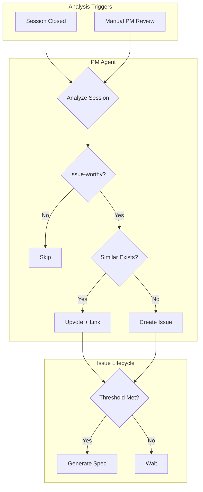
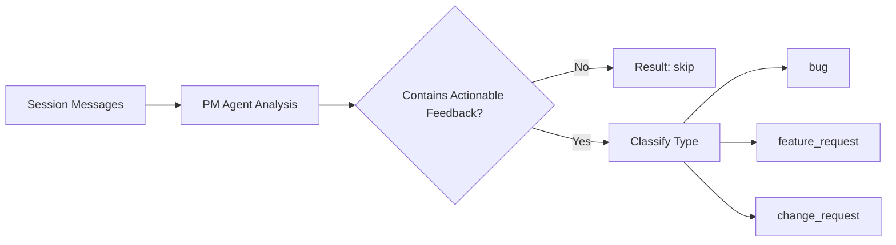
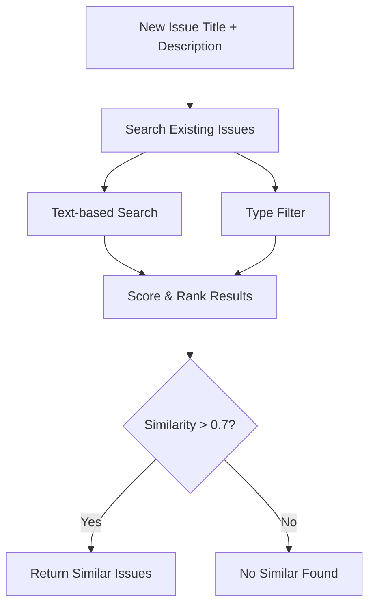
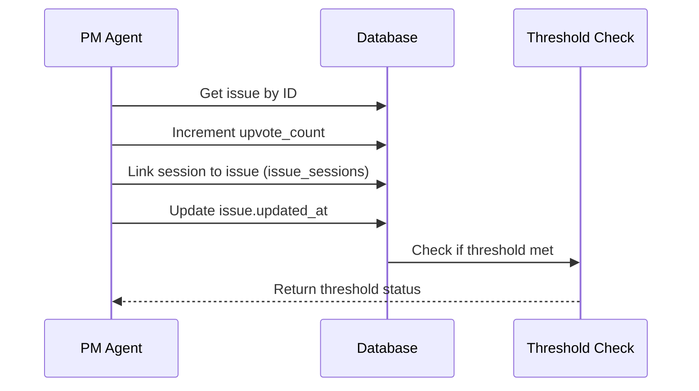
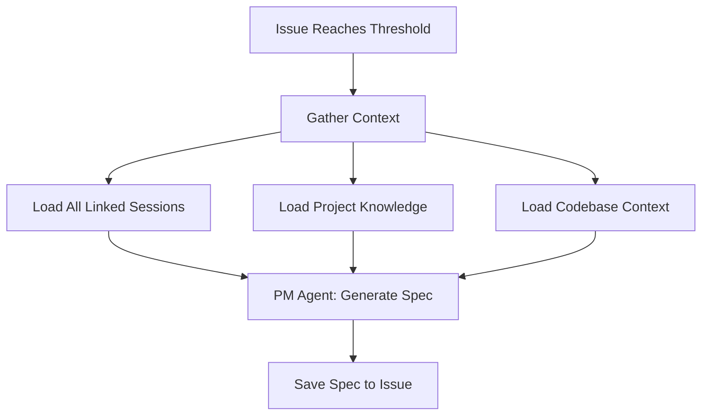

# PM Agent Issue Tracking System - Implementation Plan

## Overview

Add an Issue model and Product Manager agent that analyzes sessions (on close or manual trigger) to detect feature requests/bugs, manages issues with upvoting and similarity detection, supports manual priority override, and generates product specs when threshold is reached. Includes top-level Issues page for cross-project view.---

## Architecture



---

## Data Model

### issues table

```sql
CREATE TABLE issues (
  id uuid PRIMARY KEY DEFAULT gen_random_uuid(),
  project_id uuid NOT NULL REFERENCES projects(id) ON DELETE CASCADE,
  type text NOT NULL CHECK (type IN ('bug', 'feature_request', 'change_request')),
  title text NOT NULL,
  description text NOT NULL,
  priority text NOT NULL DEFAULT 'low' CHECK (priority IN ('low', 'medium', 'high')),
  priority_manual_override boolean DEFAULT false,
  upvote_count integer DEFAULT 1,
  status text DEFAULT 'open' CHECK (status IN ('open', 'in_progress', 'resolved', 'closed')),
  product_spec text,
  product_spec_generated_at timestamptz,
  created_at timestamptz DEFAULT now(),
  updated_at timestamptz DEFAULT now()
);

CREATE TABLE issue_sessions (
  issue_id uuid REFERENCES issues(id) ON DELETE CASCADE,
  session_id text REFERENCES sessions(id) ON DELETE CASCADE,
  created_at timestamptz DEFAULT now(),
  PRIMARY KEY (issue_id, session_id)
);

CREATE TABLE project_settings (
  project_id uuid PRIMARY KEY REFERENCES projects(id) ON DELETE CASCADE,
  issue_spec_threshold integer DEFAULT 3,
  created_at timestamptz DEFAULT now(),
  updated_at timestamptz DEFAULT now()
);

-- Add PM review tracking to sessions
ALTER TABLE sessions ADD COLUMN pm_reviewed_at timestamptz;
```

---

## PM Agent Core Logic

### 1. Session Analysis & Classification

When a session is analyzed (either on close or via manual trigger), the PM agent performs a structured analysis of the conversation.**Input to Agent:**

- Full session messages (from Mastra storage)
- Session metadata (page URL, user info, timestamps)
- Project context (name, description)

**Classification Process:**



**Classification Criteria:**| Type | Signals | Examples ||------|---------|----------|| `bug` | Error descriptions, "doesn't work", "broken", unexpected behavior, crashes | "The checkout button doesn't respond when I click it" || `feature_request` | "I wish", "it would be nice", "can you add", missing functionality | "It would be great if I could export to PDF" || `change_request` | "Should be different", UX complaints, workflow improvements | "The settings page is confusing, could you reorganize it?" |**Skip Criteria (not issue-worthy):**

- Pure Q&A sessions (user asked, got answer, satisfied)
- Sessions with < 3 messages
- Conversations that ended with resolution
- General inquiries without actionable feedback

**Agent Output Schema:**

```typescript
interface SessionAnalysisResult {
  isActionable: boolean
  type?: 'bug' | 'feature_request' | 'change_request'
  title?: string           // Concise title (max 100 chars)
  description?: string     // Detailed description with context
  userQuotes?: string[]    // Key quotes from the user
  suggestedPriority?: 'low' | 'medium' | 'high'
  confidence: number       // 0-1 confidence score
  reasoning?: string       // Why this classification was made
}
```

**PM Agent Instructions (key excerpt):**

```markdown
You are a Product Manager analyzing customer support sessions to identify:
1. Bugs - Issues where the product isn't working as expected
2. Feature Requests - New functionality users are asking for
3. Change Requests - Improvements to existing functionality

For each session:
1. Read all messages to understand the full context
2. Determine if the user expressed actionable feedback (not just questions)
3. If actionable, classify the type and extract a clear title + description
4. Include direct quotes from the user to preserve their voice
5. Assess priority based on: user frustration level, impact mentioned, frequency hints

Skip sessions that are:
- Simple Q&A with satisfactory resolution
- Very short (< 3 messages)
- Off-topic or spam
```

---

### 2. Similar Issue Detection

Before creating a new issue, the agent searches for existing issues that might be duplicates or related.**Similarity Search Strategy:**



**Search Implementation:**

```typescript
interface FindSimilarIssuesInput {
  projectId: string
  title: string
  description: string
  type: 'bug' | 'feature_request' | 'change_request'
}

interface SimilarIssueResult {
  issue: Issue
  similarityScore: number  // 0-1
  matchReason: string      // "Title match", "Description overlap", etc.
}
```

**Matching Criteria:**

1. **Same project** - Only match within the same project
2. **Same or compatible type** - Bugs match bugs, features match features
3. **Text similarity** - Compare title and description
4. **Status filter** - Only match open/in_progress issues (not closed/resolved)

**Similarity Algorithm (initial implementation - keyword-based):**

```typescript
function calculateSimilarity(newIssue: IssueInput, existingIssue: Issue): number {
  // 1. Extract keywords from titles (remove stop words)
  const newKeywords = extractKeywords(newIssue.title + ' ' + newIssue.description)
  const existingKeywords = extractKeywords(existingIssue.title + ' ' + existingIssue.description)
  
  // 2. Calculate Jaccard similarity
  const intersection = newKeywords.filter(k => existingKeywords.includes(k))
  const union = [...new Set([...newKeywords, ...existingKeywords])]
  
  return intersection.length / union.length
}
```

**Future Enhancement:** Use embeddings (OpenAI or local) for semantic similarity instead of keyword matching.**Agent Decision Flow:**

```typescript
// In PM Agent tool execution
const similarIssues = await findSimilarIssues({ projectId, title, description, type })

if (similarIssues.length > 0 && similarIssues[0].similarityScore > 0.7) {
  // Upvote the most similar issue
  await upvoteIssue(similarIssues[0].issue.id, sessionId)
} else {
  // Create new issue
  await createIssue({ projectId, title, description, type, sessionId })
}
```

---

### 3. Upvoting Mechanism

When a similar issue is found, instead of creating a duplicate, the agent upvotes the existing issue and links the new session.**Upvote Process:**



**Database Operations:**

```typescript
async function upvoteIssue(issueId: string, sessionId: string): Promise<UpvoteResult> {
  const supabase = createAdminClient()
  
  // 1. Get current issue state
  const { data: issue } = await supabase
    .from('issues')
    .select('*, project:projects(id, name)')
    .eq('id', issueId)
    .single()
  
  // 2. Increment upvote count
  const newUpvoteCount = issue.upvote_count + 1
  
  // 3. Calculate new priority (if not manually overridden)
  const newPriority = issue.priority_manual_override 
    ? issue.priority 
    : calculatePriority(newUpvoteCount)
  
  // 4. Update issue
  await supabase
    .from('issues')
    .update({ 
      upvote_count: newUpvoteCount,
      priority: newPriority,
      updated_at: new Date().toISOString()
    })
    .eq('id', issueId)
  
  // 5. Link session to issue
  await supabase
    .from('issue_sessions')
    .insert({ issue_id: issueId, session_id: sessionId })
    .onConflict('issue_id, session_id')
    .ignore() // Prevent duplicate links
  
  // 6. Get project settings for threshold
  const { data: settings } = await supabase
    .from('project_settings')
    .select('issue_spec_threshold')
    .eq('project_id', issue.project_id)
    .single()
  
  const threshold = settings?.issue_spec_threshold ?? 3
  const thresholdMet = newUpvoteCount >= threshold && !issue.product_spec
  
  return {
    issueId,
    newUpvoteCount,
    newPriority,
    thresholdMet,
    shouldGenerateSpec: thresholdMet
  }
}
```

**Priority Escalation on Upvote:**| Upvote Count | Auto Priority ||--------------|---------------|| 1-2 | low || 3-4 | medium || 5+ | high |Note: If `priority_manual_override = true`, the priority remains unchanged regardless of upvotes.---

### 4. Product Spec Generation

When an issue's upvote count reaches the configured threshold, the PM agent generates a comprehensive product specification.**Trigger Conditions:**

1. `upvote_count >= issue_spec_threshold` (default: 3)
2. `product_spec IS NULL` (hasn't been generated yet)
3. Can also be triggered manually via UI button

**Spec Generation Flow:**



**Context Gathered for Spec Generation:**

```typescript
interface SpecGenerationContext {
  issue: {
    id: string
    title: string
    description: string
    type: 'bug' | 'feature_request' | 'change_request'
    upvote_count: number
  }
  sessions: {
    id: string
    messages: ChatMessage[]
    user_metadata: Record<string, string>
    page_url: string
  }[]
  project: {
    name: string
    description: string
  }
  knowledge?: {
    product: string    // Product knowledge package content
    technical: string  // Technical knowledge package content
  }
}
```

**Product Spec Structure:**

```markdown
# Product Specification: [Issue Title]

## Summary
[One paragraph executive summary]

## Problem Statement
[What problem are users experiencing? Include user quotes]

## User Impact
- **Affected Users**: [Who is affected]
- **Frequency**: [How often does this occur - based on upvotes]
- **Severity**: [Based on user feedback]

## Supporting Evidence
[List of linked sessions with key quotes]
- Session 1: "[User quote]"
- Session 2: "[User quote]"

## Proposed Solution
[High-level approach to solving this]

## Technical Considerations
[Based on codebase knowledge, what areas might be affected]

## Acceptance Criteria
1. [Criterion 1]
2. [Criterion 2]
3. [Criterion 3]

## Out of Scope
[What this spec explicitly does NOT cover]

## Open Questions
[Questions that need product/engineering discussion]
```

**PM Agent Spec Generation Instructions:**

```markdown
You are generating a Product Specification for a validated issue.

You have access to:
1. The issue details (title, description, type)
2. All session conversations that contributed to this issue
3. Project knowledge packages (product and technical)

Generate a comprehensive spec that:
1. Clearly states the problem from the user's perspective
2. Includes direct quotes from users to preserve their voice
3. Considers technical feasibility based on the codebase
4. Provides actionable acceptance criteria
5. Identifies risks and open questions

The spec should be detailed enough for an engineer to understand the scope
but not prescribe specific implementation details.
```

**Database Update After Spec Generation:**

```typescript
async function saveProductSpec(issueId: string, spec: string): Promise<void> {
  const supabase = createAdminClient()
  
  await supabase
    .from('issues')
    .update({
      product_spec: spec,
      product_spec_generated_at: new Date().toISOString(),
      updated_at: new Date().toISOString()
    })
    .eq('id', issueId)
}
```

**Manual Spec Generation:**Users can also trigger spec generation manually via the UI, even if the threshold hasn't been met. This is useful for high-priority issues that need immediate attention.---

## Session Close Implementation

Three triggers for closing sessions and invoking PM agent:| Trigger | Implementation ||---------|----------------|| **Inactivity cron** | Supabase Edge Function runs every 15 mins, closes sessions inactive 30+ mins || **Widget close event** | `beforeunload` sends beacon to `/api/sessions/[id]/close` || **Manual close** | Dashboard button |---

## Priority Logic

```typescript
function calculatePriority(issue: Issue): Priority {
  // If user manually set priority, respect it
  if (issue.priority_manual_override) {
    return issue.priority
  }
  
  // Auto-calculate based on upvotes
  if (issue.upvote_count >= 5) return 'high'
  if (issue.upvote_count >= 3) return 'medium'
  return 'low'
}
```

---

## Mastra Tools Specification

The PM Agent will use the following tools to interact with the system:

### Tool 1: `analyze-session`

Analyzes a session's messages and determines if it contains actionable feedback.

```typescript
const analyzeSessionTool = createTool({
  id: 'analyze-session',
  description: `Analyze a support session to determine if it contains actionable feedback.
Returns classification (bug/feature_request/change_request) if actionable, or skip reason if not.`,
  inputSchema: z.object({
    sessionId: z.string().describe('The session ID to analyze'),
  }),
  outputSchema: z.object({
    isActionable: z.boolean(),
    type: z.enum(['bug', 'feature_request', 'change_request']).optional(),
    title: z.string().optional(),
    description: z.string().optional(),
    userQuotes: z.array(z.string()).optional(),
    suggestedPriority: z.enum(['low', 'medium', 'high']).optional(),
    skipReason: z.string().optional(),
    confidence: z.number(),
  }),
  execute: async ({ context, runtimeContext }) => {
    // 1. Get session metadata from Supabase
    // 2. Get session messages from Mastra storage
    // 3. Return structured data for agent to analyze
    // Agent will use this data to make classification decision
  }
})
```


### Tool 2: `find-similar-issues`

Searches for existing issues that might be duplicates or related.

```typescript
const findSimilarIssuesTool = createTool({
  id: 'find-similar-issues',
  description: `Search for existing issues similar to the one being created.
Returns ranked list of potential duplicates with similarity scores.`,
  inputSchema: z.object({
    projectId: z.string(),
    title: z.string(),
    description: z.string(),
    type: z.enum(['bug', 'feature_request', 'change_request']),
  }),
  outputSchema: z.object({
    similarIssues: z.array(z.object({
      issueId: z.string(),
      title: z.string(),
      description: z.string(),
      upvoteCount: z.number(),
      similarityScore: z.number(),
      matchReason: z.string(),
    })),
    hasSimilar: z.boolean(),
  }),
  execute: async ({ context }) => {
    // 1. Query issues table for same project + type
    // 2. Calculate text similarity scores
    // 3. Return ranked results with similarity > 0.3
  }
})
```


### Tool 3: `create-issue`

Creates a new issue and links it to the originating session.

```typescript
const createIssueTool = createTool({
  id: 'create-issue',
  description: `Create a new issue from session analysis.
Links the session to the issue and sets initial priority.`,
  inputSchema: z.object({
    projectId: z.string(),
    sessionId: z.string(),
    type: z.enum(['bug', 'feature_request', 'change_request']),
    title: z.string().max(200),
    description: z.string(),
    suggestedPriority: z.enum(['low', 'medium', 'high']).optional(),
  }),
  outputSchema: z.object({
    issueId: z.string(),
    success: z.boolean(),
    error: z.string().optional(),
  }),
  execute: async ({ context }) => {
    // 1. Insert into issues table
    // 2. Insert into issue_sessions junction table
    // 3. Return new issue ID
  }
})
```


### Tool 4: `upvote-issue`

Upvotes an existing issue and links a new session to it.

```typescript
const upvoteIssueTool = createTool({
  id: 'upvote-issue',
  description: `Upvote an existing issue when a similar concern is raised.
Links the new session, increments upvote count, and updates priority if not manually overridden.`,
  inputSchema: z.object({
    issueId: z.string(),
    sessionId: z.string(),
  }),
  outputSchema: z.object({
    success: z.boolean(),
    newUpvoteCount: z.number(),
    newPriority: z.enum(['low', 'medium', 'high']),
    thresholdMet: z.boolean(),
    error: z.string().optional(),
  }),
  execute: async ({ context }) => {
    // 1. Increment upvote_count
    // 2. Recalculate priority (if not manually overridden)
    // 3. Insert into issue_sessions
    // 4. Check if threshold is met
    // 5. Return results
  }
})
```


### Tool 5: `generate-product-spec`

Generates a comprehensive product specification for an issue.

```typescript
const generateProductSpecTool = createTool({
  id: 'generate-product-spec',
  description: `Generate a comprehensive product specification for an issue.
Gathers all linked sessions, project knowledge, and creates a detailed spec.`,
  inputSchema: z.object({
    issueId: z.string(),
  }),
  outputSchema: z.object({
    success: z.boolean(),
    spec: z.string().optional(),
    error: z.string().optional(),
  }),
  execute: async ({ context }) => {
    // 1. Get issue with all linked sessions
    // 2. Get all session messages
    // 3. Get project knowledge packages (product, technical)
    // 4. Compile context for spec generation
    // 5. Agent generates spec using this context
    // 6. Save spec to issue
  }
})
```


### Tool 6: `get-session-context`

Helper tool to retrieve full session context for analysis.

```typescript
const getSessionContextTool = createTool({
  id: 'get-session-context',
  description: `Get full context for a session including messages and metadata.`,
  inputSchema: z.object({
    sessionId: z.string(),
  }),
  outputSchema: z.object({
    session: z.object({
      id: z.string(),
      projectId: z.string(),
      userId: z.string().nullable(),
      userMetadata: z.record(z.string()).nullable(),
      pageUrl: z.string().nullable(),
      pageTitle: z.string().nullable(),
      messageCount: z.number(),
      status: z.enum(['active', 'closed']),
    }),
    messages: z.array(z.object({
      role: z.enum(['user', 'assistant', 'system']),
      content: z.string(),
      createdAt: z.string(),
    })),
    project: z.object({
      id: z.string(),
      name: z.string(),
      description: z.string().nullable(),
    }),
  }),
  execute: async ({ context }) => {
    // 1. Get session from Supabase
    // 2. Get messages from Mastra storage
    // 3. Get project info
    // 4. Return combined context
  }
})
```

---

## API Endpoints Detail

### POST `/api/sessions/[id]/pm-review`

Manually trigger PM analysis on a session.

```typescript
// Request: No body required
// Response:
interface PMReviewResponse {
  success: boolean
  result: {
    action: 'created' | 'upvoted' | 'skipped'
    issueId?: string
    issuetitle?: string
    skipReason?: string
    thresholdMet?: boolean
    specGenerated?: boolean
  }
  error?: string
}
```


### POST `/api/sessions/[id]/close`

Close a session and optionally trigger PM analysis.

```typescript
// Request:
interface CloseSessionRequest {
  triggerPMReview?: boolean  // default: true
}
// Response:
interface CloseSessionResponse {
  success: boolean
  pmReviewResult?: PMReviewResponse['result']
}
```


### POST `/api/projects/[id]/issues/[issueId]/generate-spec`

Manually trigger product spec generation.

```typescript
// Request: No body required
// Response:
interface GenerateSpecResponse {
  success: boolean
  spec?: string
  error?: string
}
```

---

## Files to Create

### Database

- `supabase/migrations/YYYYMMDD_add_issues.sql`

### Types

- `src/types/issue.ts`

### Agent and Tools

- `src/mastra/agents/product-manager-agent.ts`
- `src/mastra/tools/issue-tools.ts`

### API Routes

- `src/app/api/projects/[id]/issues/route.ts` - List/Create issues
- `src/app/api/projects/[id]/issues/[issueId]/route.ts` - Get/Update issue
- `src/app/api/projects/[id]/issues/[issueId]/generate-spec/route.ts` - Generate spec
- `src/app/api/projects/[id]/settings/route.ts` - Project settings
- `src/app/api/sessions/[id]/close/route.ts` - Close session + trigger PM
- `src/app/api/sessions/[id]/pm-review/route.ts` - Manual PM review

### Database Queries

- `src/lib/supabase/issues.ts`

### Hooks

- `src/hooks/use-issues.ts`

### UI Pages

- `src/app/(authenticated)/issues/page.tsx` - Top-level issues (cross-project)
- `src/app/(authenticated)/projects/[id]/issues/page.tsx` - Project issues
- `src/app/(authenticated)/projects/[id]/issues/[issueId]/page.tsx` - Issue detail

### UI Components

- `src/components/issues/issues-page.tsx`
- `src/components/issues/issues-table.tsx`
- `src/components/issues/issues-filters.tsx`
- `src/components/issues/issue-sidebar.tsx`
- `src/components/issues/issue-detail.tsx`
- `src/components/issues/product-spec-view.tsx`

### Supabase Functions

- `supabase/functions/close-stale-sessions/index.ts`

---

## Files to Modify

| File | Change ||------|--------|| `src/mastra/index.ts` | Register PM agent || `src/components/sessions/session-sidebar.tsx` | Add PM Review button || `src/app/(authenticated)/layout.tsx` | Add Issues nav item || `src/types/supabase.ts` | Regenerate after migration |---

## Implementation Todos

- [ ] **db-migration**: Create migration for issues, issue_sessions, project_settings tables + sessions.pm_reviewed_at
- [ ] **types**: Create TypeScript types for Issue, IssueSession, ProjectSettings
- [ ] **pm-agent**: Implement Product Manager agent with session analysis instructions
- [ ] **issue-tools**: Create Mastra tools: analyze-session, find-similar-issues, create-issue, upvote-issue, generate-spec
- [ ] **session-close-api**: Create POST /api/sessions/[id]/close endpoint with PM agent trigger
- [ ] **session-close-cron**: Create Supabase Edge Function for auto-closing inactive sessions
- [ ] **pm-review-api**: Create POST /api/sessions/[id]/pm-review for manual PM analysis trigger
- [ ] **issues-api**: Create issues CRUD API routes for projects
- [ ] **db-queries**: Create lib/supabase/issues.ts with query functions
- [ ] **issues-hook**: Create React hook use-issues.ts for data fetching
- [ ] **issues-top-page**: Build /issues page with cross-project filtering (similar to /sessions)
- [ ] **issue-detail-ui**: Build issue detail sidebar with linked sessions and product spec
- [ ] **session-pm-button**: Add PM Review button to session-sidebar.tsx
- [ ] **nav-update**: Add Issues link to authenticated layout navigation
- [ ] **project-settings-ui**: Add threshold configuration to project settings

---

## Implementation Order

1. Database migration
2. TypeScript types
3. PM Agent + Tools
4. Session close logic (API + Edge Function)
5. Issues API routes
6. PM Review API route
7. Database query functions
8. React hooks
9. Top-level Issues page
10. Issue detail components
11. Session sidebar PM Review button
12. Navigation update
13. Project settings UI